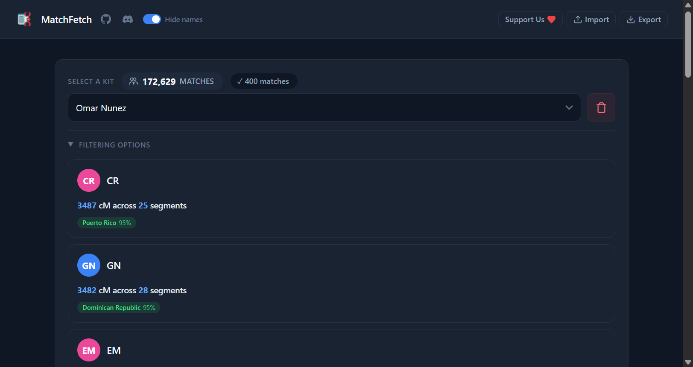

# MatchFetch

Fetch, browse, and explore your AncestryDNA match data.

## Features

- **Match List** — View all matches in a card layout with photos, names, cM/segments, and journey pills. Filter by name, cM range, ancestral journeys, and ethnicity regions (with percentage ranges).
- **Match Detail** — Click any match to see their ethnicity breakdown grouped by macro region with confidence ranges, plus a hierarchical ancestral journey tree. Both tabs include interactive Leaflet maps.
- **Multiple Kits** — Switch between DNA kits, each stored separately in IndexedDB.
- **Fetch Options** — By default fetches all matches. Click **Fetch options** to limit by count (first N matches) or cM range (all matches within a centimorgan window). Resume interrupted fetches.
- **Check for New Matches** — After all matches have been fetched, click **Check for new matches** to find and fetch any new matches since the last fetch.
- **Persistent Storage** — All match data, profiles, ethnicity estimates, and journeys are saved locally in IndexedDB via Dexie.js. No re-fetching needed after the initial load.
- **Import / Export** — Download all data as JSON or restore from a backup.
- **Privacy** — Toggle to hide names on cards.

## Installation

1. Download or clone this repo
2. Open Chrome and go to `chrome://extensions`
3. Enable **Developer mode** (toggle in the top right)
4. Click **Load unpacked** and select the `matchfetch_ext` folder
5. The MatchFetch icon will appear in your toolbar

## Usage

1. Click the MatchFetch icon in your browser toolbar
2. Select a kit from the dropdown
3. Click **Fetch** to get all matches, or expand **Fetch options** to choose **Count** (enter number of matches) or **cM Range** (enter min/max cM)
4. Cards appear progressively as data is fetched. Use **Filtering options** to narrow by name, cM range, ancestral journeys, or ethnicity regions with percentage ranges
5. Click any card to open the detail page
6. After fetching, use **Check for new matches** to pick up any new matches
7. Use **Export** to download all data as JSON, **Import** to restore a previous backup

---

Created by Omar Nunez · Version 1.1.1

_23andMe support coming soon._
